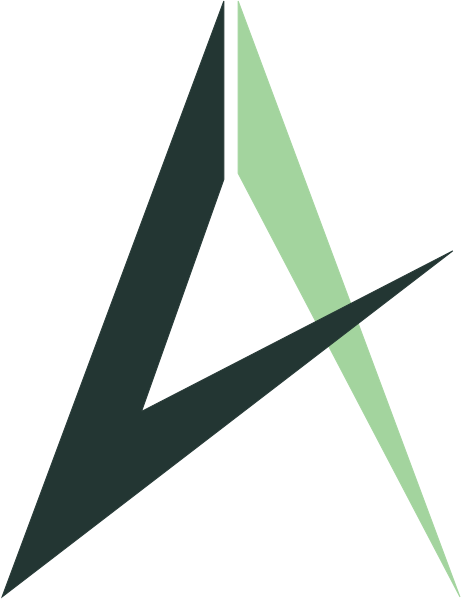

<!-- Improved compatibility of back to top link: See: https://github.com/othneildrew/Best-README-Template/pull/73 -->
<a name="readme-top"></a>
<!--
*** Thanks for checking out the Best-README-Template. If you have a suggestion
*** that would make this better, please fork the repo and create a pull request
*** or simply open an issue with the tag "enhancement".
*** Don't forget to give the project a star!
*** Thanks again! Now go create something AMAZING! :D
-->


<!-- PROJECT SHIELDS -->
<!--
*** I'm using markdown "reference style" links for readability.
*** Reference links are enclosed in brackets [ ] instead of parentheses ( ).
*** See the bottom of this document for the declaration of the reference variables
*** for contributors-url, forks-url, etc. This is an optional, concise syntax you may use.
*** https://www.markdownguide.org/basic-syntax/#reference-style-links
-->
<!-- PROJECT LOGO -->
<br />
<div align="center">
  <a href="https://github.com/Juls95/atletz_martketplace">
    
  </a>

<h3 align="center">Atletz</h3>

  <p align="center">
    Empower talent, share triumphs
    <br />
    <a href="#-challenges-we-ran-into"><strong>🤯 READ THIS TO SEE THE DEMO </strong></a></li>
    <br />
    <br />
    <a href="https://atletz.io/">View Demo</a>
    ·
    <a href="https://github.com/Juls95/atletz_martketplace/issues">Report Bug</a>
    ·
    <a href="https://github.com/Juls95/atletz_martketplace/issues">Request Feature</a>
  </p>
</div>


<!-- TABLE OF CONTENTS -->
<details>
  <summary>Table of Contents</summary>
  <ol>
    <li>
      <a href="#why-atletz">Why Atletz</a>
      <ul>
        <li><a href="#built-with">Built With</a></li>
      </ul>
    </li>
    <li>
      <a href="#getting-started">Getting Started</a>
      <ul>
        <li><a href="#prerequisites">Prerequisites</a></li>
        <li><a href="#installation">Installation</a></li>
      </ul>
    </li>
    <li><a href="#-challenges-we-ran-into">🤯 Challenges we ran into</a></li>
    <li><a href="#roadmap">Roadmap</a></li>
    <li><a href="#contributing">Contributing</a></li>
    <li><a href="#contact">Contact</a></li>
  </ol>
</details>


<!-- ABOUT THE PROJECT -->
## Why ATLETZ?

<a href="https://atletz.io">
    
  </a>


The human being is a social being; he likes to belong to and feel identified with a community. Regarding **Atletz**, we are the company that will combine Blockchain technology, AI, and Sports by allowing followers of a particular discipline to have access and opportunity to invest in athletes who will be recommended by an AI system based on people's information and interactions as well as the quality of the athlete (reputation, commitment, transparency...). 

This will allow followers to be part of the growth of an athlete who will be able to create their community, grow in their sport, and, in return to their investors, will give benefits such as courses, lessons, events, and even a part of their profit once they meet their primary objective.


<p align="right">(<a href="#readme-top">back to top</a>)</p>


### Built With

* Next.js
* React.js
* Node.js
* Liteflow
* Web3
* hardhat
* Lightlink

<p align="right">(<a href="#readme-top">back to top</a>)</p>


<!-- GETTING STARTED -->
## Getting Started

This is an example of how you may give instructions on setting up your project locally.
To get a local copy up and running follow these simple example steps.


### Installation

1. Clone the repo
   ```sh
   git clone https://github.com/Juls95/atletz_martketplace
   ```
2. Install BUN packages
   ```sh
   npm install
   ```
3. Create a .env file in the root folder and add the following parameters:
   ```js
   NEXT_PUBLIC_LITEFLOW_BASE_URL=
   NEXT_PUBLIC_LITEFLOW_API_KEY=
   NEXT_PUBLIC_BASE_URL=
   ```
4. Execute the following:
   ```js
   npm run dev
   ```

<p align="right">(<a href="#readme-top">back to top</a>)</p>

## 🤯 Challenges we ran into
* **Big problem**: Errors when integrating LIghtlink and walletconnect with LIteflow. Many time waste on this ''
* Very **hard to integrate the front with the Backend**. Many problems when deploying the marketplace into Vercel. Here are the screenshots of the localhost:
    - https://harlequin-gigantic-bird-154.mypinata.cloud/ipfs/QmSv8ANw3mrxeZRG8VoJ6vq2VkPX7XWHPvNUkZeEkakt8s?pinataGatewayToken=Hq-GhBZ-v7o6Z-6QmYFoJSMrAiNleHTdAj-va55o_jKyD9QlCG6Hofn2EtNMJCwA
    - https://harlequin-gigantic-bird-154.mypinata.cloud/ipfs/QmXnCWi7r8ovBhpzchmqh7ST4rzebjMNc2Fjs4cPMKyugk?pinataGatewayToken=Hq-GhBZ-v7o6Z-6QmYFoJSMrAiNleHTdAj-va55o_jKyD9QlCG6Hofn2EtNMJCwA
    - https://harlequin-gigantic-bird-154.mypinata.cloud/ipfs/QmTnQnP264jGWr7hwePkKfTQpduSyxaeXhUAEgTycE9rTo?pinataGatewayToken=Hq-GhBZ-v7o6Z-6QmYFoJSMrAiNleHTdAj-va55o_jKyD9QlCG6Hofn2EtNMJCwA
* **Limited workshops**. I would love to have more workshops related to integrations and explanation of the features. Fortunately, most of the time the community people help with this (after lot of time because of Timezone difference with Mexico)
* **Time management**. As mentioned before, the problem with workshops, we lost a lot of time finding the correct solution to our problem

<!-- ROADMAP -->
## Roadmap

- [x] Create prototype of Atletz
- [x] Test cards and basic functionalities
- [x] Create prototype of the project
- [x] Create the branding for Atletz
- [x] Create a first versiont for the marketplace
- [ ] Connecct Frontend and Backend
- [ ] Modify Look and Feel
- [ ] Fix errors
- [ ] Move to Mainnet and bring Athletes and Fans to the project


See the [open issues](https://github.com/Juls95/atletz_martketplace/issues/issues) for a full list of proposed features (and known issues).

<p align="right">(<a href="#readme-top">back to top</a>)</p>


<!-- CONTRIBUTING -->
## Contributing

Contributions are what make the open source community such an amazing place to learn, inspire, and create. Any contributions you make are **greatly appreciated**.

If you have a suggestion that would make this better, please fork the repo and create a pull request. You can also simply open an issue with the tag "enhancement".
Don't forget to give the project a star! Thanks again!

1. Fork the Project
2. Create your Feature Branch (`git checkout -b feature/AmazingFeature`)
3. Commit your Changes (`git commit -m 'Add some AmazingFeature'`)
4. Push to the Branch (`git push origin feature/AmazingFeature`)
5. Open a Pull Request

<p align="right">(<a href="#readme-top">back to top</a>)</p>


<!-- LICENSE -->
## License

Distributed under the MIT License. See `LICENSE.txt` for more information.

<p align="right">(<a href="#readme-top">back to top</a>)</p>


<!-- CONTACT -->
## Contact

Julián Ramírez - [@julsr_mx](https://twitter.com/julsr_mx) - juramirez.ve@gmail.com

Project Link: [https://github.com/Juls95/atletz_martketplace](https://github.com/Juls95/atletz_martketplace)

<p align="right">(<a href="#readme-top">back to top</a>)</p>


<p align="right">(<a href="#readme-top">back to top</a>)</p>


<!-- MARKDOWN LINKS & IMAGES -->
<!-- https://www.markdownguide.org/basic-syntax/#reference-style-links -->
[contributors-shield]: https://img.shields.io/github/contributors/github_username/repo_name.svg?style=for-the-badge
[contributors-url]: https://github.com/github_username/repo_name/graphs/contributors
[forks-shield]: https://img.shields.io/github/forks/github_username/repo_name.svg?style=for-the-badge
[forks-url]: https://github.com/github_username/repo_name/network/members
[stars-shield]: https://img.shields.io/github/stars/github_username/repo_name.svg?style=for-the-badge
[stars-url]: https://github.com/github_username/repo_name/stargazers
[issues-shield]: https://img.shields.io/github/issues/github_username/repo_name.svg?style=for-the-badge
[issues-url]: https://github.com/github_username/repo_name/issues
[license-shield]: https://img.shields.io/github/license/github_username/repo_name.svg?style=for-the-badge
[license-url]: https://github.com/github_username/repo_name/blob/master/LICENSE.txt
[linkedin-shield]: https://img.shields.io/badge/-LinkedIn-black.svg?style=for-the-badge&logo=linkedin&colorB=555
[linkedin-url]: https://www.linkedin.com/in/julianramirez95/
[product-screenshot]: images/home.png
[Next.js]: https://img.shields.io/badge/next.js-000000?style=for-the-badge&logo=nextdotjs&logoColor=white
[Next-url]: https://nextjs.org/
[React.js]: https://img.shields.io/badge/React-20232A?style=for-the-badge&logo=react&logoColor=61DAFB
[React-url]: https://reactjs.org/
[Vue.js]: https://img.shields.io/badge/Vue.js-35495E?style=for-the-badge&logo=vuedotjs&logoColor=4FC08D
[Vue-url]: https://vuejs.org/
[Angular.io]: https://img.shields.io/badge/Angular-DD0031?style=for-the-badge&logo=angular&logoColor=white
[Angular-url]: https://angular.io/
[Svelte.dev]: https://img.shields.io/badge/Svelte-4A4A55?style=for-the-badge&logo=svelte&logoColor=FF3E00
[Svelte-url]: https://svelte.dev/
[Laravel.com]: https://img.shields.io/badge/Laravel-FF2D20?style=for-the-badge&logo=laravel&logoColor=white
[Laravel-url]: https://laravel.com
[Bootstrap.com]: https://img.shields.io/badge/Bootstrap-563D7C?style=for-the-badge&logo=bootstrap&logoColor=white
[Bootstrap-url]: https://getbootstrap.com
[JQuery.com]: https://img.shields.io/badge/jQuery-0769AD?style=for-the-badge&logo=jquery&logoColor=white
[JQuery-url]: https://jquery.com 
